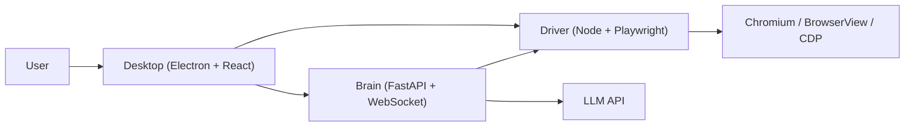

# Alphomi

Alphomi is an open local agent workspace that combines a desktop browser shell, a Playwright execution driver, and a Python brain service into one product.

## Screenshots

Alphomi ships with both light and dark desktop themes for the browser workspace and AI sidebar.

| Light Mode | Dark Mode |
| --- | --- |
|  |  |

## What It Does

- Runs as a local desktop app with browser tabs, address bar, downloads, and a live AI sidebar
- Uses a Playwright-based driver for browser automation, snapshots, visual inspection, and session management
- Uses a Python brain service for LLM orchestration, tool calling, approvals, and multi-agent workflows
- Ships as a desktop installer while keeping the repository open-source and contributor-friendly

## Repository Layout

```text
apps/
  desktop/         Electron + React desktop shell
  driver/          Playwright driver and adapter
  brain/           Python brain service
packages/
  contracts/       Shared schemas and protocol references
  config/          Shared configuration defaults and schema docs
  ui/              Shared UI primitives for the desktop renderer
tools/
  eval-manager/    Evaluation and operational tooling
docs/
  adr/             Architecture decision records
  plans/           Implementation plans
  guides/          Contributor and release documentation
test/              Cross-app smoke and regression scripts
```

## Quick Start

### Prerequisites

- Node.js 18+
- pnpm 8+
- Python 3.11+
- `uv` recommended for Python environment management

### Bootstrap

```bash
pnpm bootstrap
```

`pnpm bootstrap` creates a local `config.yaml` from `config.example.yaml` the first time you run it.

### Development

```bash
pnpm dev
```

Common focused workflows:

```bash
pnpm dev:desktop
pnpm dev:driver
pnpm dev:brain
```

### Validation

```bash
pnpm doctor
pnpm typecheck
pnpm test
pnpm smoke
pnpm validate
pnpm clean
```

## Product Architecture



## Open-Source Goals

- Clean monorepo with explicit app boundaries
- No hidden Python setup during Node installation
- Shared docs and contracts for cross-language collaboration
- Release-ready packaging with contributor-friendly local setup

See [docs/guides/development.md](docs/guides/development.md), [docs/guides/testing.md](docs/guides/testing.md), and [docs/adr/0001-adopt-dual-stack-monorepo.md](docs/adr/0001-adopt-dual-stack-monorepo.md).

Additional docs:

- [Architecture guide](docs/guides/architecture.md)
- [Configuration guide](docs/guides/configuration.md)
- [Troubleshooting guide](docs/guides/troubleshooting.md)
- [Release guide](docs/guides/release.md)
- [Release checklist](docs/guides/release-checklist.md)
- [Maintainer guide](docs/guides/maintainers.md)
- [Roadmap](ROADMAP.md)
- [Changelog](CHANGELOG.md)

## Community Files

- [CONTRIBUTING.md](CONTRIBUTING.md)
- [CODE_OF_CONDUCT.md](CODE_OF_CONDUCT.md)
- [SECURITY.md](SECURITY.md)
- [SUPPORT.md](SUPPORT.md)
