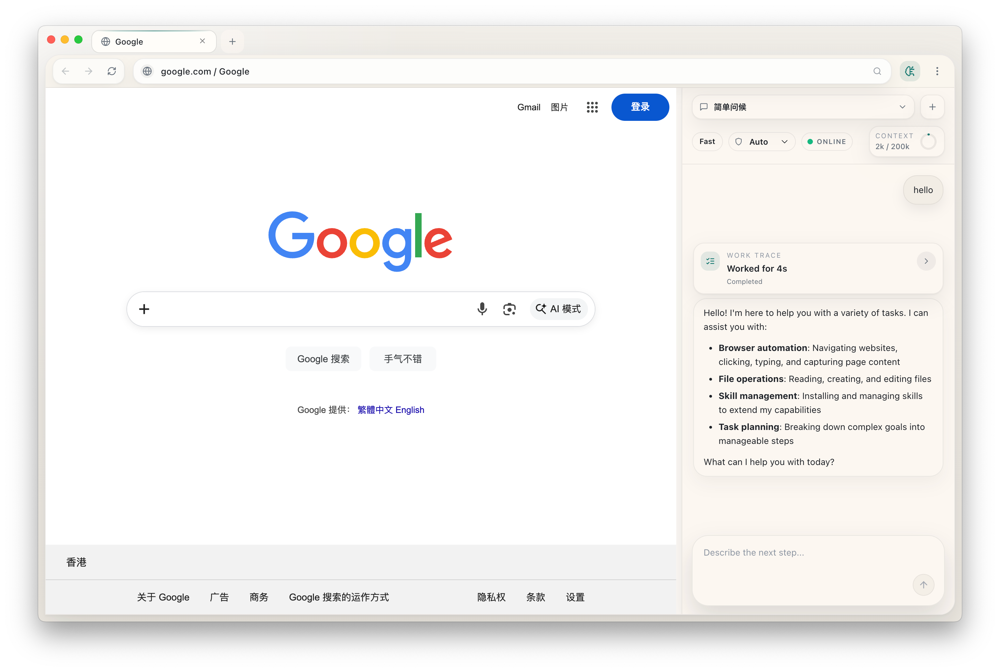
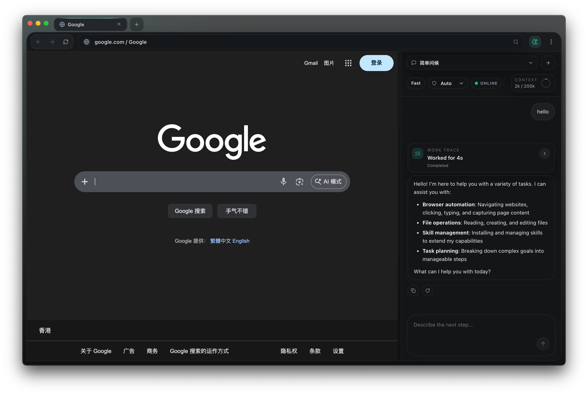
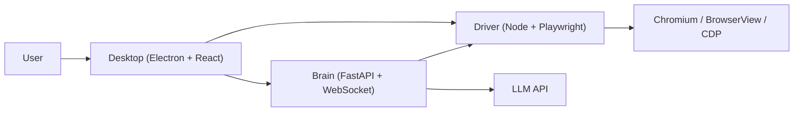

# Alphomi

English | [简体中文](README.zh-CN.md)

Alphomi is an open local agent workspace for the web and your computer. It combines an Electron desktop shell, a Playwright browser driver, and a Python brain service into one contributor-friendly product.

<a id="table-of-contents"></a>
## Table of Contents

- [Overview](#overview)
- [Screenshots](#screenshots)
- [Why Alphomi](#why-alphomi)
- [Architecture](#architecture)
- [Repository Layout](#repository-layout)
- [Quick Start](#quick-start)
- [Documentation](#documentation)
- [Community](#community)

<a id="overview"></a>
## Overview

Alphomi is designed as a local-first agent workspace:

- Browse and work inside a desktop browser shell with tabs, navigation, downloads, and an AI sidebar.
- Run browser automation through a Playwright-based Driver.
- Orchestrate tool calls, approvals, and multi-agent workflows through a Python Brain service.
- Keep the repository open-source and modular while shipping as one desktop product.

[Back to top](#table-of-contents)

<a id="screenshots"></a>
## Screenshots

Alphomi ships with both light and dark desktop themes for the browser workspace and AI sidebar.

| Light Mode | Dark Mode |
| --- | --- |
|  |  |

[Back to top](#table-of-contents)

<a id="why-alphomi"></a>
## Why Alphomi

- `Local-first`: the Desktop, Driver, and Brain can run on your machine for fast iteration and controlled data flow.
- `Contributor-friendly`: the monorepo keeps app boundaries clear instead of hiding setup behind implicit scripts.
- `Open-source ready`: shared contracts, config docs, release notes, and maintainer guides live in the repository.
- `One product, multiple runtimes`: Electron handles the desktop UX, Playwright handles browser control, and Python handles orchestration.

[Back to top](#table-of-contents)

<a id="architecture"></a>
## Architecture



This repository follows a dual-stack monorepo design:

- `apps/desktop` owns the desktop shell and renderer UX.
- `apps/driver` owns Playwright sessions, automation, snapshots, and browser-facing tools.
- `apps/brain` owns LLM orchestration, approvals, and agent workflows.
- `packages/contracts` and `packages/config` provide shared protocol and configuration references.

[Architecture Guide](docs/guides/architecture.md) | [ADR: Dual-Stack Monorepo](docs/adr/0001-adopt-dual-stack-monorepo.md) | [ADR: Bundled Brain Binary](docs/adr/0002-ship-brain-as-bundled-binary.md)

[Back to top](#table-of-contents)

<a id="repository-layout"></a>
## Repository Layout

```text
apps/
  desktop/         Electron + React desktop shell
  driver/          Playwright driver and automation adapter
  brain/           Python brain service
packages/
  contracts/       Shared schemas and protocol references
  config/          Shared configuration defaults and schema docs
  ui/              Shared UI primitives for the desktop renderer
tools/
  eval-manager/    Evaluation and operational tooling
docs/
  adr/             Architecture decision records
  guides/          Contributor and release documentation
test/              Cross-app smoke and regression scripts
```

[Back to top](#table-of-contents)

<a id="quick-start"></a>
## Quick Start

### Prerequisites

- Node.js 18.18+
- pnpm 8+
- Python 3.11+
- `uv` recommended for Python environment management

### Bootstrap

```bash
pnpm bootstrap
```

`pnpm bootstrap` installs workspace dependencies, prepares the Python environment, installs Playwright browsers, and creates a local `config.yaml` from `config.example.yaml` if needed.

### Run the Full Workspace

```bash
pnpm dev
```

### Run a Single Layer

```bash
pnpm dev:desktop
pnpm dev:driver
pnpm dev:brain
```

### Validate the Repository

```bash
pnpm doctor
pnpm typecheck
pnpm test
pnpm smoke
pnpm validate
```

### Package a Local App Build

```bash
pnpm run package:mac:dir
```

[Development Guide](docs/guides/development.md) | [Testing Guide](docs/guides/testing.md) | [Release Guide](docs/guides/release.md)

[Back to top](#table-of-contents)

<a id="documentation"></a>
## Documentation

### Getting Started

- [Configuration Guide](docs/guides/configuration.md)
- [Development Guide](docs/guides/development.md)
- [Testing Guide](docs/guides/testing.md)
- [Troubleshooting Guide](docs/guides/troubleshooting.md)

### Maintainer References

- [Architecture Guide](docs/guides/architecture.md)
- [Release Guide](docs/guides/release.md)
- [Release Checklist](docs/guides/release-checklist.md)
- [Maintainer Guide](docs/guides/maintainers.md)

### Project Context

- [Roadmap](ROADMAP.md)
- [Changelog](CHANGELOG.md)
- [ADR Template](docs/adr/0000-template.md)

[Back to top](#table-of-contents)

<a id="community"></a>
## Community

- [Contributing Guide](CONTRIBUTING.md)
- [Code of Conduct](CODE_OF_CONDUCT.md)
- [Security Policy](SECURITY.md)
- [Support](SUPPORT.md)

The repository is currently `UNLICENSED` while the open-source release details are still being finalized.

[Back to top](#table-of-contents)
