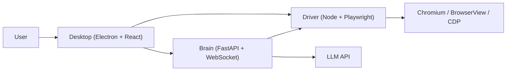

# Alphomi

[English](README.md) | 简体中文

Alphomi 是一个面向网页与本地电脑的开源本地化 Agent 工作台。它将 Electron 桌面壳、Playwright 浏览器驱动和 Python Brain 服务整合为一个适合持续迭代与开源协作的产品。

<a id="table-of-contents"></a>
## 目录

- [概览](#overview)
- [界面截图](#screenshots)
- [为什么是 Alphomi](#why-alphomi)
- [系统架构](#architecture)
- [仓库结构](#repository-layout)
- [快速开始](#quick-start)
- [文档导航](#documentation)
- [社区与协作](#community)

<a id="overview"></a>
## 概览

Alphomi 按照本地优先的思路设计：

- 在桌面浏览器工作台中完成标签页浏览、导航、下载和 AI 侧边栏交互。
- 通过基于 Playwright 的 Driver 执行浏览器自动化与页面能力。
- 通过 Python Brain 服务编排工具调用、审批流和多 Agent 工作流。
- 保持仓库清晰、可开源、可协作，同时又能作为一个桌面产品分发。

[返回目录](#table-of-contents)

<a id="screenshots"></a>
## 界面截图

Alphomi 当前提供浅色与深色两套桌面工作区主题。

| 浅色模式 | 深色模式 |
| --- | --- |
|  |  |

[返回目录](#table-of-contents)

<a id="why-alphomi"></a>
## 为什么是 Alphomi

- `本地优先`：Desktop、Driver 与 Brain 都可以直接在本机运行，调试快、数据路径清晰。
- `适合贡献者`：monorepo 保留明确的应用边界，不靠隐式脚本把复杂度藏起来。
- `面向开源`：共享协议、配置说明、发布文档、维护者文档都放在仓库中。
- `一个产品，多种运行时`：Electron 负责桌面交互，Playwright 负责浏览器控制，Python 负责智能编排。

[返回目录](#table-of-contents)

<a id="architecture"></a>
## 系统架构



这个仓库采用双栈 monorepo 设计：

- `apps/desktop` 负责桌面壳与渲染层体验。
- `apps/driver` 负责 Playwright 会话、自动化、快照与浏览器工具。
- `apps/brain` 负责 LLM 编排、审批流与 Agent 工作流。
- `packages/contracts` 与 `packages/config` 负责共享协议与配置参考。

[架构指南](docs/guides/architecture.zh-CN.md) | [ADR：双栈 Monorepo](docs/adr/0001-adopt-dual-stack-monorepo.md) | [ADR：内置 Brain 二进制](docs/adr/0002-ship-brain-as-bundled-binary.md)

[返回目录](#table-of-contents)

<a id="repository-layout"></a>
## 仓库结构

```text
apps/
  desktop/         Electron + React 桌面壳
  driver/          Playwright 驱动与自动化适配层
  brain/           Python Brain 服务
packages/
  contracts/       共享 schema 与协议参考
  config/          共享配置默认值与 schema 文档
  ui/              桌面渲染层共享 UI 组件
tools/
  eval-manager/    评测与运维辅助工具
docs/
  adr/             架构决策记录
  guides/          开发、测试、发布与维护文档
test/              跨应用 smoke 与回归脚本
```

[返回目录](#table-of-contents)

<a id="quick-start"></a>
## 快速开始

### 环境要求

- Node.js 18.18+
- pnpm 8+
- Python 3.11+
- 推荐安装 `uv` 管理 Python 环境

### 初始化

```bash
pnpm bootstrap
```

`pnpm bootstrap` 会安装 workspace 依赖、准备 Python 环境、安装 Playwright 浏览器，并在缺少本地配置时基于 `config.example.yaml` 生成 `config.yaml`。

### 启动完整工作区

```bash
pnpm dev
```

### 按层启动

```bash
pnpm dev:desktop
pnpm dev:driver
pnpm dev:brain
```

### 验证仓库

```bash
pnpm doctor
pnpm typecheck
pnpm test
pnpm smoke
pnpm validate
```

### 本地打包桌面应用

```bash
pnpm run package:mac:dir
```

[开发指南](docs/guides/development.zh-CN.md) | [测试指南](docs/guides/testing.zh-CN.md) | [发布指南](docs/guides/release.zh-CN.md)

[返回目录](#table-of-contents)

<a id="documentation"></a>
## 文档导航

### 入门文档

- [配置指南](docs/guides/configuration.zh-CN.md)
- [开发指南](docs/guides/development.zh-CN.md)
- [测试指南](docs/guides/testing.zh-CN.md)
- [排障指南](docs/guides/troubleshooting.md)

### 维护者文档

- [架构指南](docs/guides/architecture.zh-CN.md)
- [发布指南](docs/guides/release.zh-CN.md)
- [发布检查清单](docs/guides/release-checklist.md)
- [维护者指南](docs/guides/maintainers.md)

### 项目背景

- [Roadmap](ROADMAP.md)
- [Changelog](CHANGELOG.md)
- [ADR 模板](docs/adr/0000-template.md)

[返回目录](#table-of-contents)

<a id="community"></a>
## 社区与协作

- [贡献指南](CONTRIBUTING.zh-CN.md)
- [行为准则](CODE_OF_CONDUCT.md)
- [安全策略](SECURITY.zh-CN.md)
- [支持说明](SUPPORT.zh-CN.md)

当前仓库的开源发布细节仍在整理中，因此仓库暂时保持 `UNLICENSED` 状态。

[返回目录](#table-of-contents)
