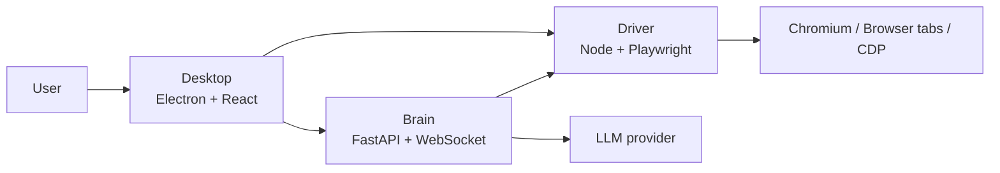

# Architecture Guide

## Design Goals

Alphomi is built as a dual-stack monorepo with explicit runtime boundaries:

- `apps/desktop`: Electron shell and React UI
- `apps/driver`: Node and Playwright automation runtime
- `apps/brain`: Python and FastAPI agent orchestration runtime

The goal is not to force one language everywhere. The goal is to keep each layer in the ecosystem where it is strongest while making the repository feel like one product.

## Runtime Topology

## Repository Boundaries

- `apps/desktop` owns window management, BrowserView or WebContentsView layout, process orchestration, and packaged-app boot flow.
- `apps/driver` owns browser sessions, snapshots, visual inspection, storage state, and browser tool execution.
- `apps/brain` owns workflow orchestration, tool routing, conversation state, and model integration.
- `packages/contracts` holds shared schemas and protocol references.
- `packages/config` holds contributor-facing defaults and config docs.
- `tools/` is for support utilities, not product runtime.

## Packaging Strategy

Source development stays modular, but release artifacts are unified:

1. Build the Python Brain into a bundled binary.
2. Build the Desktop and Driver assets.
3. Package the Electron app with the Driver assets and Brain binary embedded.

This keeps contributor workflows explicit while giving end users a single installable product.

## Change Management Rules

- If you change app boundaries or packaging behavior, add or update an ADR.
- If you change a shared protocol, update `packages/contracts` and the consumer code together.
- If you add setup friction, document it in `docs/guides/`.
