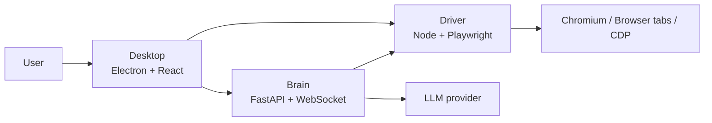

# 架构指南

[English](architecture.md) | 简体中文

## 设计目标

Alphomi 采用双栈 monorepo，并明确划分运行时边界：

- `apps/desktop`：Electron 桌面壳与 React UI
- `apps/driver`：Node 与 Playwright 自动化运行时
- `apps/brain`：Python 与 FastAPI 的 Agent 编排运行时

目标不是把所有东西强行统一成一种语言，而是让每一层都待在自己最合适的技术生态里，同时让整个仓库对贡献者来说像一个完整产品。

## 运行时拓扑

## 仓库边界

- `apps/desktop` 负责窗口管理、BrowserView 或 WebContentsView 布局、进程编排与打包后的启动流程
- `apps/driver` 负责浏览器会话、快照、视觉检查、状态持久化与浏览器工具执行
- `apps/brain` 负责工作流编排、工具路由、对话状态与模型集成
- `packages/contracts` 保存共享 schema 与协议参考
- `packages/config` 保存贡献者可见的默认配置与配置文档
- `tools/` 只放辅助工具，不承载产品运行时

## 打包策略

源码开发阶段保持模块化，但发布产物统一为一个桌面产品：

1. 将 Python Brain 构建为内置二进制
2. 构建 Desktop 与 Driver 产物
3. 使用 Electron 将 Driver 资源与 Brain 二进制一起打进桌面应用

这样既能让贡献者保持清晰的开发边界，也能让终端用户只面对一个可安装产品。

## 变更管理规则

- 如果改动影响应用边界或打包行为，新增或更新 ADR
- 如果改动共享协议，必须同步更新 `packages/contracts` 与消费方代码
- 如果引入新的初始化复杂度，要同步补到 `docs/guides/` 文档里
